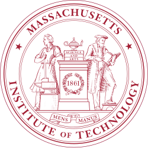

## About Me

I am an undergraduate student majoring in Data Science at the University of Science and Technology of China (USTC). Currently, I am a research intern at the [LDS Lab](https://data-science.ustc.edu.cn/_upload/tpl/15/04/5380/template5380/index.html) at USTC, advised by Prof.[Wenjie Wang](https://scholar.google.com/citations?user=Ma5DtmoAAAAJ&hl=en) and Prof.[Fuli Feng](https://scholar.google.com/citations?user=QePM4u8AAAAJ&hl=en). Besides, I am also a research intern at the [CSAIL Lab](https://www.csail.mit.edu/) at MIT, advised by Prof.[Wojciech Matusik](https://scholar.google.com/citations?hl=en&user=wbIMbL8AAAAJ). My research interests lie in NLP, generative models, particularly Large Language Models (LLMs) and Large Multimodal Models (LMMs).

**I sincerely appreciate my mentors for their guidance and trust, as well as all senior students and teachers for their generous help. It is the invaluable opportunities you have given me and the collective support from everyone that have kept me going until today.**

**I am looking for potential PhD positions. If you are interested, please feel free to contact me!**

## Research Interests

My research interests focus on advancing the training of Large Language Models to enhance their core capabilities in understanding, reasoning, and generation, with three interconnected technical dimensions:

+ From the data perspective, investigating methodologies for constructing, acquiring, and filtering high-quality training data to maximize the efficacy of model training.
+ From the algorithm perspective, exploring the design of more stable and efficient training algorithms that adapt to diverse task characteristics, ensuring robust model performance across scenarios.
+ From the training paradigm perspective, developing innovative, high-performance paradigms (e.g., enabling models to learn from interaction with humans/environments, test-time dynamic learning) to bridge the gap between general pre-training and real-world downstream task demands.

## Education & Experience

  

    
  

  

    <strong><a href="https://www.csail.mit.edu/">MIT, CSAIL</a></strong> 
    Research Intern, 2025 – present 
    Advised by <a href="https://scholar.google.com/citations?hl=en&user=wbIMbL8AAAAJ">Prof. Wojciech Matusik</a>
  

  

    
  

  

    <strong><a href="https://data-science.ustc.edu.cn/_upload/tpl/15/04/5380/template5380/index.html">USTC, LDS</a></strong> 
    Research Intern, 2024 – present 
    Advised by <a href="https://scholar.google.com/citations?user=Ma5DtmoAAAAJ&hl=en">Prof. Wenjie Wang</a> and <a href="https://scholar.google.com/citations?user=QePM4u8AAAAJ&hl=en">Prof. Fuli Feng</a>
  

  

    
  

  

    <strong><a href="https://en.ustc.edu.cn/">USTC</a></strong> 
    B.S. in Data Science, 2022 – present
  

## News

- **[Sep. 2025]** Two papers about LLM application are submitted to ICLR 2026!
- **[Aug. 2025]** Our paper about academic paper evaluation leveraging LLMs has submitted to AAAI 2026!
- **[Jul. 2025]** Our paper about personalized image generation leveraging LMMs is accepted to ACM MM 2025 (Oral)!

## Selected Awards
  - **[Sep. 2025]** National Scholarship




